<p align="center">
  
</p>

# Octet

**HTTP, in binary: six-byte frames instead of CRLF, ten indexed headers, one TCP connection.**

Octet is a small file-serving protocol and two C programs that speak it.
`bserve` serves a directory. `bcurl` fetches from it and, with `-v`, hexdumps
every frame on the wire. The two share nothing but [SPEC.md](SPEC.md). A
client written from the spec alone has to work against `bserve`, and a server
written from it has to work against `bcurl`. A client that only works against
its own server is an implementation, not a protocol.

## Why binary

HTTP/1.1 is text, delimited by `\r\n\r\n`. So a parser has to hunt for a
delimiter that may arrive split across two TCP reads, and it never knows how
much is left until it finds it. HTTP/2 replaced that with fixed-size binary
frames and HPACK header compression. Octet reproduces that move on a small
scale: one fixed frame header, one persistent connection, and the first two
HPACK mechanisms, a static table and literals.

<p align="center">
  
</p>

Every frame starts with the same six bytes. Three give the payload length,
then one byte each for type, flags and version. The receiver reads exactly
six, then exactly `length`, looping on short reads, and never searches for
anything. Headers inside the payload are either an index into a ten-name
static table (`0x81` is `:method`) or a literal name. There is no dynamic
table and no Huffman coding.

The widths are chosen, not copied. 24 bits of length is enough for any single
frame a file server needs, and small enough that a hostile length cannot make
a receiver allocate gigabytes. The byte HTTP/2 spends on its stream ID goes to
a version number instead, because one request at a time per connection means a
stream ID would carry nothing.

## One connection

<p align="center">
  
</p>

A response is one RESPONSE frame and then DATA frames, and the last frame sets
END. Files over 16 MiB are split across DATA frames, as any body may be. After
a 404 the connection stays open for the next request. Only a malformed frame
ends it: the server answers 400, then closes.

One rule matters more than the rest. **A frame type the receiver does not know
is skipped, whole, and is never an error.** That is what lets a v2 peer that
adds new frame types still talk to a v1 peer. Unknown versions, flags and
header indices, on the other hand, are malformed, so that v2 is free to give
them meaning.

## Running it

A C11 compiler and make on Linux or another POSIX system. The tests also need
bash and python3.

```sh
make
./bserve ./www 9000 &
./bcurl localhost:9000/index.html            # body on stdout
./bcurl -v localhost:9000/hello.txt          # plus every frame, hexdumped, on stderr
./bcurl localhost:9000/ /hello.txt /nope     # three requests, one connection
make test
```

```
> REQUEST len=53 flags=END v=1
00000000  00 00 35 01 01 01 05 81  00 03 47 45 54 82 00 0a  |..5.......GET...|
00000010  2f 68 65 6c 6c 6f 2e 74  78 74 83 00 0e 6c 6f 63  |/hello.txt...loc|
00000020  61 6c 68 6f 73 74 3a 39  31 32 34 84 00 07 62 63  |alhost:9124...bc|
00000030  75 72 6c 2f 31 85 00 03  2a 2f 2a                 |url/1...*/*|
0000003b
< RESPONSE len=83 flags=0 v=1
```

Every byte of that exchange is explained, field by field, in
[docs/annotated-hexdump.md](docs/annotated-hexdump.md).

| Program | Usage | Exit 0 | Exit 1 | Exit 2 |
|---|---|---|---|---|
| `bserve` | `bserve <root> <port>` | SIGTERM | root missing, or port cannot be bound | |
| `bcurl` | `bcurl [-v] <host>:<port>/<path> [/<path> ...]` | `:status` 2xx | `:status` 4xx or 5xx | connect failure, early close, malformed response |

`bserve` binds `0.0.0.0`, forks one process per connection, and logs one line
per request to stderr: client address, path and status. `bcurl` writes only
the body to stdout, and it never opens a second connection.

## What a hostile peer can do

Octet is plaintext on a local port, so the threats that matter are the ones a
malformed or hostile peer can cause through the frame parser and the
filesystem.

- **Lengths are capped before anything is allocated.** A REQUEST longer than
  64 KiB is a 400, and every inner length is checked against the frame before
  it is read.
- **Paths cannot leave the root.** `..`, `//` and paths not starting with `/`
  are refused. The result is canonicalised with `realpath()` and must still
  sit under the canonical root. Symlinks that escape get 404.
- **Nothing outside the root leaks.** A file outside the root and a file that
  does not exist both return 404, so a client cannot probe for either.
- **Idle connections are closed.** After 30 s of silence the server closes the
  connection, and the client gives up too, so neither side hangs on a peer
  that never sends END.
- **`content-length` is never trusted.** It must equal the DATA bytes that
  actually arrive, or `bcurl` exits 2.

TLS, authentication, methods other than GET, and multiplexing are out of
scope, deliberately.

## Tested from the other side of the wire

<p align="center">
  
</p>

Testing the two programs only against each other would prove they agree with
each other, not with the spec. So [`tests/wire.py`](tests/wire.py) is a second,
independent Octet implementation in Python, written from SPEC.md and sharing
no code with `src/`. It stands in for the partner's program. It sends `bserve`
every malformed frame the spec lists, requests trickled one byte per TCP
write, pipelined requests, unknown frame types, `..` paths and escaping
symlinks. Then it turns into a fake server and feeds `bcurl` responses that
close early, lie about their length, or claim version 9.

The suite also passes under AddressSanitizer and UndefinedBehaviorSanitizer.

## Deliverables

| # | Item | Done when | Where |
|---|---|---|---|
| 1 | The spec, two pages | A stranger can implement the other side from it alone | [SPEC.md](SPEC.md) |
| 2 | The programs | They interoperate with an independent peer | [`src/bserve.c`](src/bserve.c), [`src/bcurl.c`](src/bcurl.c), [`src/octet.c`](src/octet.c) |
| 3 | Annotated hexdump of one request and response | Every byte is explained by the spec | [docs/annotated-hexdump.md](docs/annotated-hexdump.md) |

## Layout

```
SPEC.md                    the wire specification, the only shared contract
docs/annotated-hexdump.md  one real exchange, every byte explained
docs/art/                  the drawings in this README
src/octet.h, src/octet.c   frames, header blocks and the hexdump, shared by both
src/bserve.c               the server
src/bcurl.c                the client
tests/run.sh               end-to-end suite, run by make test
tests/wire.py              the independent Python peer
www/                       a sample document root
```
